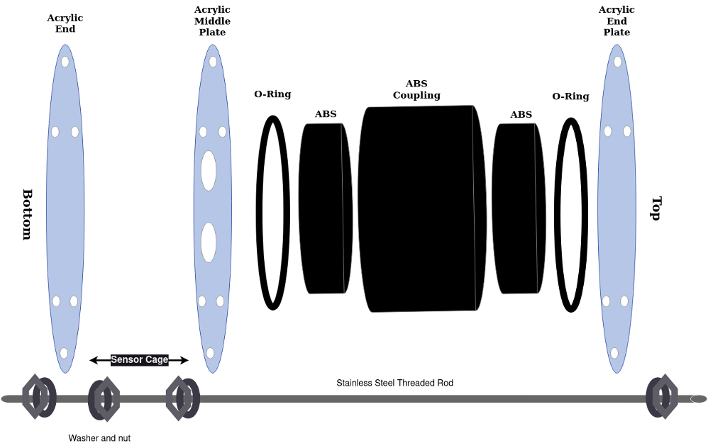

# RRIV Methane Beta Setup
## Overview
Beta version RRIV loggers with methane (CH<sub>4</sub>) and carbon dioxide (CO<sub>2</sub>). Methane sensors use a Figaro NGM2611-E13 metal oxide sensor and CO<sub>2</sub> sensors use a Atlas Scientific infrared carbon dioxide sensor. Sensors were encased in segments of 2" PVC pipe with one end covered by a 0.005" thick PTFE diaphragm to permit gas exchange with the water.

## Tools
* 2 adjustable wrench 3/8” to 1 ¼”
* Pliers 3/8” to 1 ¼”
* Mini USB to USB cable
* [Programming header](https://www.st.com/en/evaluation-tools/nucleo-f103rb.html) (Figure 1)
* ABS Rubber Cement
* [Molykote Grease](https://www.dupont.com/molykote.html)


*Figure 1: ST Nucleo programming header*

## Included components
* RRIV Data Logger (V0.21)
* [Enclosed CH<sub>4</sub> sensor]()
* Enclosed CO<sub>2</sub> sensor
* ABS sonde housing

## Off the shelf components to purchase
| Item | Number Needed per Device| Source & Part Number |
| ----------- | ----------- | ----------- |
| EPDM O-Ring (Size: Dash Number 341) | 2 | [McMaster-Carr 9557K316](https://www.mcmaster.com/9557K316/) |
| 18-8 stainless steel threaded rod 3/8” – 16 [2']   | 6 | [McMaster-Carr 98804A031](https://www.mcmaster.com/98804A031/) |
| 18-8 stainless steel hex nuts 3/8” -16 | 24 | [McMaster-Carr 91845A031](https://www.mcmaster.com/91845A031/) |
| 18-8 stainless steel washers 3/8” | 24 | [McMaster-Carr 92141A031](https://www.mcmaster.com/92141A031/) |
| Tenergy rechargeable NiMH D cell batteries | 6 | [Tenergy D Cell Batteries](https://power.tenergy.com/8pcs-tenergy-centura-lite-nimh-d-1-2v-3000mah-rechargeable-batteries/) |
| Tenergy NiMH D cell battery charger | 1 | [Tenergy Battery Charger](https://www.tenergy.com/01480) |
| Dupont jumper cables F-F | 5 | [Digikey 1528-1961-ND](https://www.digikey.com/en/products/detail/adafruit-industries-llc/1950/6827084) |
| Dupont jumper cables M-M | 3 | [Digikey 1568-1512-ND](https://www.digikey.com/en/products/detail/sparkfun-electronics/PRT-12795/5993860) |
| Copper Mesh Roll | 1 | [Home Depot](https://www.homedepot.com/p/Bird-B-Gone-Copper-Mesh-20-ft-Roll-for-Rodent-and-Bird-Control-CMS-20/205862497) |

## Initial sensor setup and configuration
* Install [Microsoft VS Code](https://code.visualstudio.com/) and then from within *VS Code* install the [PlatformIO extension](https://platformio.org/).
* Go to https://github.com/rrivirr/rriv and clone the repository there with github or download manually to a folder on your computer.
* Use dupont jumper cables to connect the programming board to the RRIV logger for communication following Figures 2 and 3.
* Connect the methane sensor plugs to the board as pictured in Figure 4. Plug the remaining 4-pin plug into the port on the back of the board.
* Plug the usb cable into the programming board and the computer your are using.
* Open VS Code and select the PlatformIO icon on the left side of the VS Code window. On the platformio home screen select `open project` and navigate to *folder* containing the RRIV repository you downloaded and select `open folder`.
* Now use the keys CTRL+SHIFT+P (macos: CMD+SHIFT+P) and type serial monitor.
	* This will present you with an option for `PlatformIO: Serial Monitor`.
	* While your computer is connected via USB to the RRIV logger is connected to a power source, select the `PlatformIO: Serial Monitor`. This will open a serial connection that will allow you to give commands to the RRIV logger.
* To learn more about the command line interface (CLI) and the commands available check RRIV documentation here or type `help` into the RRIV CLI command prompt and hit enter.
* To configure the sensor paste the following commands in the CLI one at a time (press enter after each command):<br>
&emsp;*Command for setting up sampling interval*:<br> ```set-config {"loggerName":"writeOnBoard", "siteName":"7char", "deploymentIdentifier":"15char", "wakeInterval":60, "startUpDelay":0, "burstNumber":60, "interBurstDelay":1}```<br>
&emsp;*Command that configures the humidity sensor integrated with the methane sensor:*<br>```set-slot-config {"slot":1, "type":"adafruit_dht22", "tag":"dht", "burst_size":10, "sensor_pin":5}```<br>
&emsp;*Command that configures the CO<sub>2</sub> sensor:*<br>```set-slot-config {"slot":2, "type":"atlas_co2", "tag":"atlas", "burst_size":10}```<br>
&emsp;*Command that configures the CH<sub>4</sub> sensor:*<br>```set-slot-config {"slot":3, "type":"generic_analog", "tag":"ch4", "burst_size":10, "adc_select":"external", "sensor_port":2}```

* To test the sensors type the command `start-logging` while the sensors are connected to the RRIV logger and press enter. This command will continuously report sensor values until you type `stop-logging`. Note: while the system is logging, values will continuously update sensor performance using the command start-logging. This means that when you are typing `stop-logging` the letters you type in will be broken up by new lines of data. The device will still read your typing as a single command so keep typing and press enter and the logger will stop.
* To beginning using the logger type `deploy-now` and press enter. Any time the logger is powered up after this it will immediately enter deployment mode after 5 seconds and begin collecting data following the configurations set above. Thus, you can keep the device powered down and add the batteries in the field immediately before deployment.


*Figure 2: RRIV Logger with the pins that are used to connect the programming board indicated by the orange box*

 The programming board connected to a RRIV logger using a set of five dupont jumper cables. b) a close-up of the programming board with the color of the jumper cable to be connected at each pin indicated.")

*Figure 3: a) The programming board connected to a RRIV logger using a set of five dupont jumper cables. b) a close-up of the programming board with the color of the jumper cable to be connected at each pin indicated.*

 ports.")

*Figure 4: Methane and humidity sensors plugged into the analog to digital converter (ADC) ports.*

## Commands for rapid configuration of a device
* set-slot-config
	* `loggerName` is a colloquial name that has been written on the back of the board in sharpie
	* `siteName` is a 7 character string to indicate where the RRIV is being deployed, this will also be used in the folder structure of CSV output, so should be unique
	* `deploymentIdentifier` is a 15 character string to indicate what experiment is being run
	* `wakeInterval` is in minutes and determines when the board wakes up to begin measurement cycles. 60 indicates to wake up every hour, 1 indicates every minute. The next interval is calculated at the end of a measurement cycle
	* `startUpDelay` is a duration in minutes to delay before starting the measurement cycle
	* `burstNumber` indicates how many burst cycles to complete during a measurement cycle
	* `interBurstDelay` now also works as an interval given in minutes for when to begin taking readings. 1 indicates to take readings at every minute
* example of set-config that will need to be customized
```
set-config {"loggerName":"writeOnBoard", "siteName":"7char", "deploymentIdentifier":"15char", "wakeInterval":1, "startUpDelay":0, "burstNumber":60, "interBurstDelay":1}
```

* set-slot-config:
	* `slot` is a digital slot of data set aside in the EEPROM to hold a sensor configuration
	* `type` is what driver type occupies the slot, these can be found by looking in the registry.cpp and following the "\_TYPE\_STRING" definitions
	* `tag` is a 5 character prefix for column headers, these should be left alone unless there are multiple of the same sensor in a system
	* `burst_size` is the number of reading cycles that should occur per burst
	* `sensor_pin` indicates which specific GPIO pin is being used for the sensor
	* `adc_select` can be either 'internal' or 'external' and indicates whether the analog sensor data is being processed by the ADC in the MCU or the external one
	* `sensor_port` indicates which physical port the sensor is occupying
* These can and should be used as they are to setup the AHT, CO2, and CH4 sensors:
```
  set-slot-config {"slot":1, "type":"adafruit_dht22", "tag":"dht", "burst_size":10, "sensor_pin":5}
```
```
  set-slot-config {"slot":2, "type":"atlas_co2", "tag":"atlas", "burst_size":10}
```
```
  set-slot-config {"slot":3, "type":"generic_analog", "tag":"ch4", "burst_size":10, "adc_select":"external", "sensor_port":2}
```
* To check that all sensors are working properly use `start-logging` and when satisfied `stop-logging`
* If the DHT is showing errors restart the board using `restart` then try again
* If the serial is showing many I2C errors, disconnect the CO2 sensor and restart, if it is no longer showing I2C errors then manually switch the CO2 sensor from UART to I2C mode, if it is still showing I2C errors then unplug power and USB, hold reset button for a few seconds, then try again, or keep hitting the reset button until the errors clear
* To put the system in deployment mode use `deploy-now`, it will then go to sleep until the next wake interval

## Once the sensor has been deployed
* When the system has been recovered, if the system has been fully drained of power then disconnect the power source, if the system is still powered, hit the physical reset button (Black push button) before disconnecting power
* At this point you can remove the SD card and copy the data from it, then move folders into the oldData folder(we've been preserving old data on the SD cards for now), the file structure is `Data/{siteName}/epochTimestampAtFileCreation.CSV`
* Take the logger out of the case and connect the programming board to the device as described above (Figure 2)
* Open up the serial monitor in VS Code
* Power up the device with batteries or a wall outlet
* Once the device is fully booted up and you have reached the command prompt, you have 5 seconds to press the letter 'i' and then press enter. This puts the device back into interactive mode for further use

## Data
* The DHT22 reports temperature in degrees Celsius and relative humidity in percentage
* CO2 data is reported in ppm
* Methane data is reported as a digital reading, which can be converted to volts by `reading*5/4096` or millivolts `reading*5000/4096`, 5V being the voltage to the ADC and sensor, and 4096 being 2^12, which is the precision of the ADC

## Sonde assembly

*Figure 5: Assembly of the sensor housing*

* Place bolts through the solid acrylic plate that forms the back of the sonde and fix washers and nuts on the short side of the acrylic plate to holid it in place. There are a total of six bolts used for the housing.
* With the back plate of the sonde on the ground and the bolts pointing upwards, place assembled ABS housing with o-rings on the bottom. Make sure to apply a light layer of Molykote grease to the o-ring.
* Place the dowel with the battery pack inside the ABS housing.
* Take the logger assembly that is fully connected to the sensors mounted in the middle acrylic plate. Fit the holes into the plate onto the six threaded rods and slide the middle plate with the electronics down the rods and gently place the electronics into the housing. Be sure to connect the logger to the battery pack and to place a dessicant pack in the housing.
* On each bolt place a washer and nut and screw them down until they are begin tightening down on the middle acrylic plate. Use an adjustable wrench to turn each bolt approximately 1/2 turn past finger tight using a second adjustable wrench to prevent the nut next to the back plate to keep it from rotating. Make sure that the bolts are level and applying equal pressure on the acrylic plate.
* Add a second set of washers and nuts to each bolt, this time placing the bolt first and facing upwards followed by the washer. The bolts should be placed approximately 5" above the middle acrylic plate.
* Now slide the front plate down until it is resting on the washer and nut you have just placed on the threaded rod.
* Add another washer and nut to each rod and tighten each on the front plate.
* Wrap copper mesh around the cage formed around the sensors and affix with cable ties.


