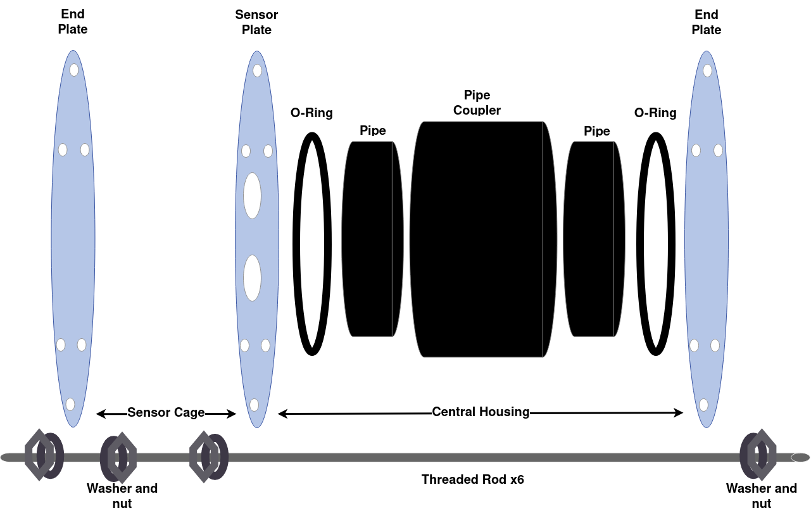
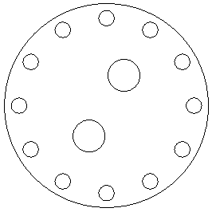
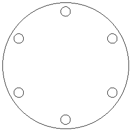
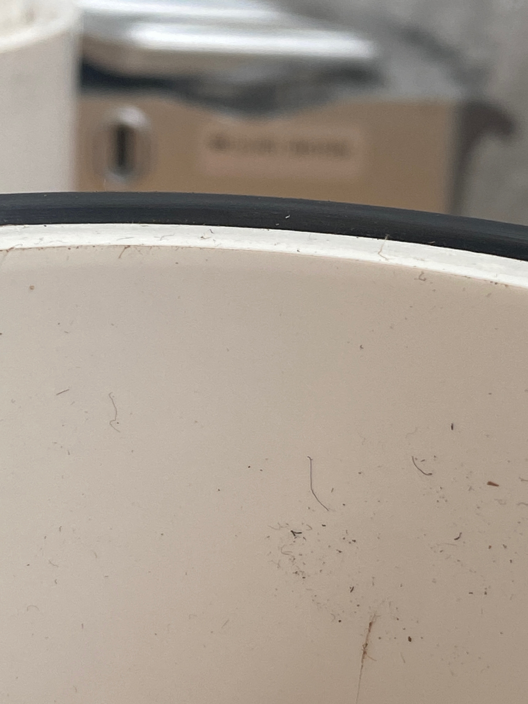
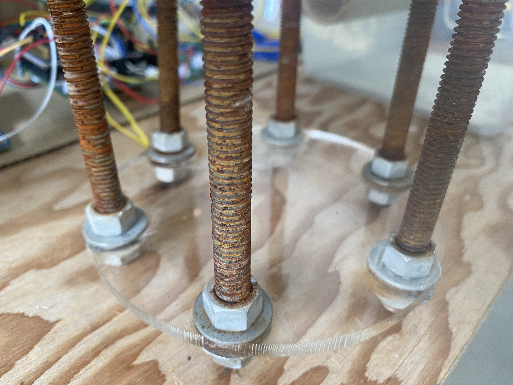

# GHG System  Case

Case specifically for use with the Figaro NGM2611-E13, Adafruit DHT22, AtlasScientific EZO-CO2 sensor, and 6 D cell batteries.  Which informs the sensor plate, cable glands, and power supply (length of case and nylon bar).
[TODO: If we removed / generalized the sensor plate and cable glands requirements / instructions this could generally be for a 12" elongated case]: #

## Bill of Materials and Potential Supplier or Drawing

[columns? availability, manufacturer part number, manufacturer, notes]: #
[comment test]: #

| Item                                                       | Case Qty   | Buy Qty   |  Supplier Part # / CAD link |
| ---------------------------------------------------------- | ---------- | --------- |  -------------------------- |
| 3" ABS Schedule 40 Pipe                                    | 12"        | 10'       | [Menards 6881155 ](https://www.menards.com/main/plumbing/pipe-fittings/abs-pipe-fittings/10-abs-sch-40-plain-end-cellular-core-dwv-pipe/abs033000600hc/p-1444426392509-c-8562.htm) |
| 3" ABS Hub x Hub Coupler                                   | 2          | 1         | [Menards 6881537 ](https://www.menards.com/main/plumbing/pipe-fittings/abs-pipe-fittings/nibco-reg-hub-abs-dwv-coupling/i00975h/p-1444449159767-c-8562.htm) |
| -341 EPDM 70A O-ring                                       | 2          | 15        | [McMaster-Carr 9557K316](https://www.mcmaster.com/9557K316/) |
| 18-8 Stainless Steel Threaded Rod 3/8" -16                 | 6          | 2'        | [McMaster-Carr 98804A031](https://www.mcmaster.com/98804A031/) |
| 18-8 Stainless Steel Hex Nuts 3/8" -16                     | 24         | 100       | [McMaster-Carr 91845A031](https://www.mcmaster.com/91845A031/) |
| 18-8 Stainless Steel Washers 3/8"                          | 24         | 100       | [McMaster-Carr 92141A031](https://www.mcmaster.com/92141A031/) |
| 5" Copper Mesh/Gauze                                       | 20"        | 100'      | [McMaster-Carr 6361T16 ](https://www.mcmaster.com/6361T16/) |
| Dow Corning 111 Molykote                                   | Consumable | 5.3 Fl oz | [McMaster-Carr 1204K32](https://www.mcmaster.com/1204K32/) |
| Dessicant Packet                                           | 1          | 1000      | [McMaster-Carr 2189K34](https://www.mcmaster.com/2189K34/) |
| 11" Cable Ties                                             | 4          | 100       | [McMaster-Carr 7130K55](https://www.mcmaster.com/7130K55/) |
| Dome Cap Cable Gland 1/2" NPT .19-.35" w/ O-Ring & Locknut | 2          | 1         | [elecDirect RDC13NR](https://www.elecdirect.com/cord-grips-strain-relief/cable-glands/dome-cap-cable-gland-1-2-npt-19-35-black-complete-with-o-ring-locknut) |
| 3/4" wide Velcro                                           | 1"         | 5'        | [McMaster-Carr 9273K13-9273K133](https://www.mcmaster.com/9273K13-9273K133/) |
| 18-8 Stainless Steel Phillips Flat Head #6 x 1/2" Screws   | 6          | 100       | [McMaster-Carr 90065A148](https://www.mcmaster.com/90065A148/) |
| 3/4" x 3/4" Nylon Bar                                      | 1'         | 1'        | [McMaster-Carr 8732K17](https://www.mcmaster.com/8732K17/) |
| 1/4" Clear Acrylic Lid Plate*                              | 1          | NA        | [CAD Drawing 3inch](https://github.com/rrivirr/sonde/tree/master/panels) |
| 1/4" Clear Acrylic Sensor Plate*                           | 1          | NA        | [CAD Drawing 3inch](https://github.com/rrivirr/sonde/tree/master/panels) |
| 1/4" Clear Acrylic Cage Plate*                             | 1          | NA        | [CAD Drawing 3inch](https://github.com/rrivirr/sonde/tree/master/panels) |
| ABS Cement                                                 | Consumable | NA        | [Menards  6932185](https://www.menards.com/main/plumbing/plumbing-installation-repair/pipe-cements-cleaners-primers/oatey-reg-medium-black-abs-cement-4-oz/309995/p-1444449932067-c-8530.htm?tid=-7621218153408053791&ipos=1) |
| 2D cell battery holder with center mounting points | 3 | 1 | [MPJA 36651 BH](https://www.mpja.com/Battery-Holder-2-D-Cell-Series/productinfo/36651%20BH/) |

*[Send Cut Send](https://sendcutsend.com/)

## Diagrams

## Build Process

### Tools & Skills
#### Fabrication

- [Reed TC4QP Tubing Cutter for plastic pipe](https://www.reedmfgco.com/en/products/plastic-pipe-tools/quick-release-tubing-cutters-for-plastic-pipe/tc4qp/) to cut ABS to length
- Measuring tape
- #2 phillips head screw driver 
- Power drill and 1/4" drill bit

#### Assembly
- 2x [9/16 SAE combination wrench](https://www.mcmaster.com/56255A34/) for hex nuts
- [Milwaukee 6in Diagonal Cutting Pliers](https://www.milwaukeetool.com/Products/Hand-Tools/Pliers/Diagonal-Cutters/48-22-6106) for copper mesh and cable ties

### Parts Fabrication

- Cut two 1-21/32" length sections of ABS and 1x 8-1/4" length for the hub inserts and main housing section. When making hub inserts, 20/32 to 22/32 is acceptable, too little won't hold the o-ring in place, too much won't compress the o-ring enough to seal properly. 
  - these lengths may vary depending on brand of coupler, length to cut the ABS sections the O-rings will go around are based on compressing the O-ring around 25% of it's width of 0.21" = 0.1575"  or ~5/32"
  - for the NIBCO brand coupler we found a depth of 1 1/2", so 1 1/2" + 5/32" = 1 21/32"
  - we also found the center barrier in the coupler is measured at around 1/4", 1 21/32" + 1/4 = 1 29/32", 12" - 2x 1 29/32" = ~8 1/4"
- Mark placement of battery holder screw placements on Nylon bar
- Drill 3/32" pilot holes into nylon bar (for #6 screws) according to battery holder placement centered on bar, then screw battery holder into nylon bar
- Cut 20" of copper mesh

### Assembly & Waterproofing

1. Attach cable glands 
	1. Apply a small amount of molycote to O-Ring on each cable gland
	2. Fit cable glands through their respective holes in acrylic sensor plate
	3. Tighten plastic nut on cable gland gently but firmly to ensure waterproof seal
2. Assemble main sonde housing (ABS or PVC)
	1. Assemble O-Ring ledge
		1. Find 2 3" pipe D-couplers and 2 1-21/32" sections of 3" pipe
		2. Apply plastic cement primer to one end of each D-coupler and one end of each pipe section
		3. Apply plastic cement to primed end of D-coupler.
		4. Insert primed end of each pipe section into primed and cemented end of each D-coupler
		5. Tap with rubber mallet to ensure complete insertion, and visually check that that there is no gab between the 1-21/32" pipe section and the insertion ridge inside the D-coupler.  This is essential to ensure the correct ledge height for the O-Ring.
		6. Check O-ring ledge assembly for correct height.
			1. Place an O-ring on the ledge created by the inner pipe inserted into the D-coupler in the above steps
			2. Check that at least 1.5mm of relief exists between the O-ring and the inner pipe segment for the entire circumference of the O-ring.
			3. The typical reason for a defect at this stage is incomplete insertion of the inner pipe segment into the D-coupler, which can easily compromise waterproofing.
			4. Correct assembly results:  

	2. Assemble housing body
		1. Find 2ft length of 3" pipe and 2 O-Ring ledge assembles from (i)
		2. Check O-ring ledge assembly for correct height
			1. Checking for a good seal on each O
		2. Apply plastic cement primer to open end of D-coupler on O-Ring ledge assembly and both ends of 2 ft pipe.
		3. Apply plastic cement to open and primed end of O-Ring ledge assembly
		4. Firmly insert primed 3" pipe ends into primed and cemented ends of the D-coupler on each O-Ring ledge assembly.
	3. Let cure for 3 hours

3. Build case
	1. Find 6 threaded steel rods, 24 bolts, 24 washers, 2 O-rings, one sensor  plate with cable glands attached, and 2 cage/back plates, and the housing body assembled in (2)
	2. Build starts from the cage side of the sonde case and proceeds to the back.
	3. For each hole in the cage plate, sandwich the plate between two washers and two nuts screwed onto the end of a threaded steel rod.
		1. Screw a nut about 1 inch onto the rod
		2. Slide a washer up to the nut
		3. Slide the cage plate onto the rod
		4. Slide a washer up to the cage plate
		5. Tighten a 2nd nut up to the cage plate.
		6. Repeat for each hole in the cage plate.
		7. Result looks like this: 
4. Next, use nuts and washers to create a ledge for the sensor plate to rest on.
	1. Stand the housing from (2) upright, and turn the assembly from (iii) upside down and place on top of the housing.  The cage plate will be facing upward.
	2. Mark each steel rod, using a marker or masking tape, 1 inch paste the height of the housing.  This will be the location of the ledge.
	3.  Take the assembly from (2) back off the housing and place cage plate side down on the table.
	4. Screw a nut onto each threaded rod up to the point that has been marked
	5. Place a washer on top of each nut
	6. Place the sensor plate onto the six rods and allow to rest on the 6 nuts and washers there just installed.
	7. Visually inspect that the sensor plate is reasonably flat and all six washers are at the same level.

5. Now, place O-rings and attach the back plate
	1. Place an O-ring on the O-ring ledge of one side of the housing from (2)
	1. Apply a thin layer of molykote to the entire surface of the O-ring
	1. Place the housing on the sensor plate and between the six rods, with the side with the installed O-ring facing down.
	1. Place a second O-ring on the O-ring ledge on the other side of the housing
	1. Apply a thin layer of molykote to the entire surface of the second O-ring
	1. Place the back plate onto the six rods
	2. Install a nut and washer onto each rod, and firmly screen them down onto the back plate.
	3. Check that all six sensor plate nuts are tight, and all six back plate nuts remain tight.  Tighten any nuts that appear to be loose.
	4. Visually inspect O-rings for any signs of improper compression
		1. Over-tightening: O-ring can squish out of place
		2. Under-tightening: O-ring is not in contact with acrylic plate in some location
6. Attach sensors (This step can also happen before step 5 with some experience doing assembly)
	1. Disassemble sonde case by removing the back panel, then the housing, then the sensor plate.
	2. Apply a thin layer of molykote to the inside of the cable glands
	3. Thread sensor cables (without connectors attached) through the cable glands
	4. Tighten cable glands to provide waterproof seal
	5. Reassemble sensor place, housing, and back plate onto the 6 steel rods as in (5)
	6. Assembly can now be dunk tested for waterproofness

6. Internal Assembly
	1. Ensure sonde case is disassembled
	1. Cut a 1" section of velcro.
	2. Attach velcro to back of RRIV datalogger PCA and open area on plastic rod
	3. Plug battery plug into RRIV datalogger
	4. Assemble sensor connectors
	4. Place batter/datalogger assembly upright on top of sensor plate.
	5. Plug sensors into datalogger
	6. Reassemble sonde case

8. Copper mesh
	1. Wrap copper mesh around sensor cage
	2. Secure copy mesh to sensor cage using zip ties

