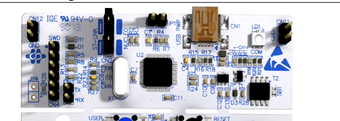
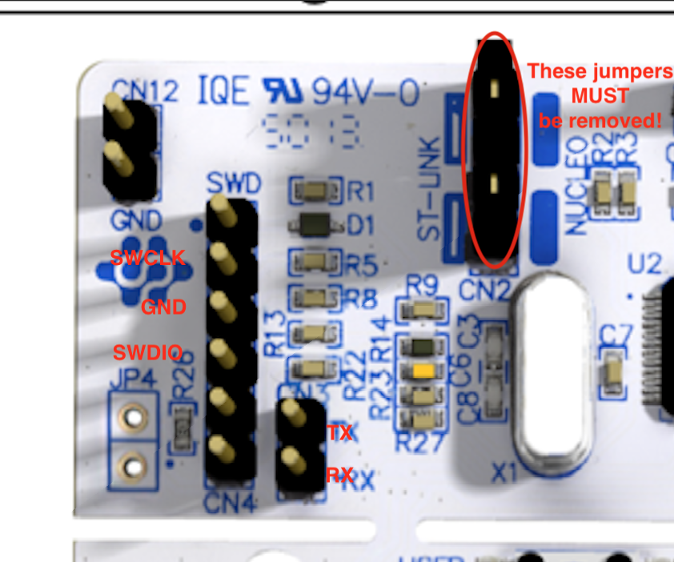
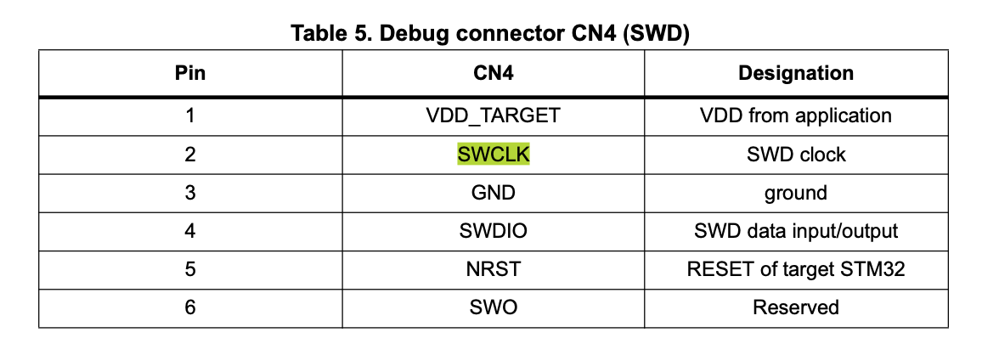

# Programming Interface

## Overview

On verions 0.4.0 and 0.4.1 of the RRIV datalogger, the ST-Link programming pins and serial interface pin are exposed in J5 and J6.  

These locations may have pin headers or JST XH size sockets installed, but either will accept Dupont connectors from the corresponding pins on the programming board.  This is the preferred way to interface with and program the MCU.

## Boards and Locations
### RRIV PCB

### RRIV PCB Layout

### Programming Board

### Programming Board Detail

### Programming Board Pinout

## Connecting the RRIV datalogger to a computer for firmware programming

1. Connect SWCLK, GND, SWDIO, RX, and TX from the programming board ot the RRIV datalogger using Dupont female-female connectors
2. Ensure that both jumpers at CN2 on the programmer board are removed
2. Plug the USB port of the programming board into the computer using a USB cable.
3. Power the RRIV board, using a second USB cable into the RRIV datalogger's USB port. (v0.4.1 boards may also be powered by battery)
4. You may now program the RRIV datalogger and monitor serial using platformio.

## Notes
* The USB port on the RRIV datalogger currently in ONLY for supplying power to the board on the bench.  The RRIV datalogger cannot currently be programmed or interacted with thorugh this port.
* In some cases the MCU on the RRIV datalogger may need to be reset in order to program it.  The recommended path for this is to power cycle the board.
 